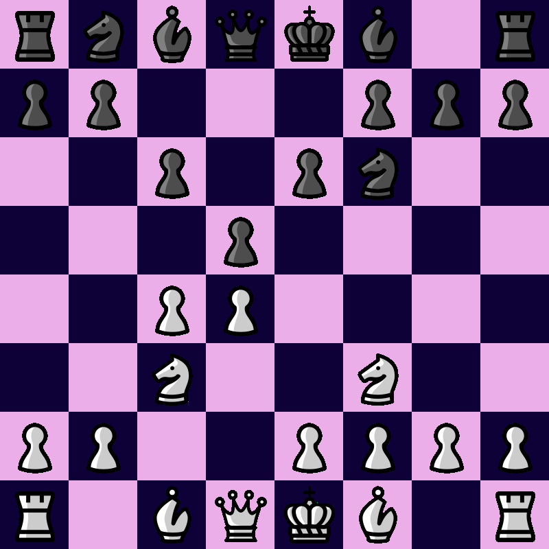

# Fentastic is a program for generating a chessboard preview.

## Build

### Linux

```console
$ git clone https://github.com/KxUgh/fentastic.git
$ cd fentastic
$ chmod +x build.sh
$ ./build.sh
```
## Gallery



## Resources

Pograph - a library for generating images<br />
https://github.com/KxUgh/pograph<br />
california - a piece set<br />
https://github.com/lichess-org/lila/tree/master/public/piece/california<br />