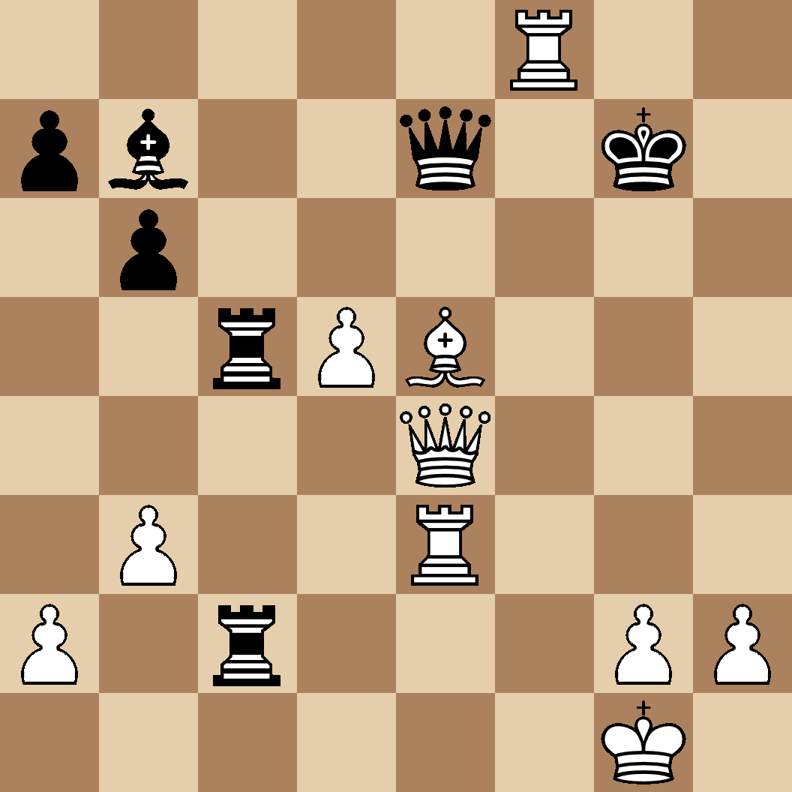

# Fentastic is a program for generating a chessboard preview.

## Features

### Easy customization

To customize the board simply change the values of the corresponding global variables. <br />
To change the look of pieces replace images in pieces directory with ones of your choosing.


## Build

### Linux

```console
$ git clone https://github.com/KxUgh/fentastic.git
$ cd fentastic
$ chmod +x build.sh
$ ./build.sh
```
## Gallery




## Resources

Pograph - a library for generating images<br />
https://github.com/KxUgh/pograph
